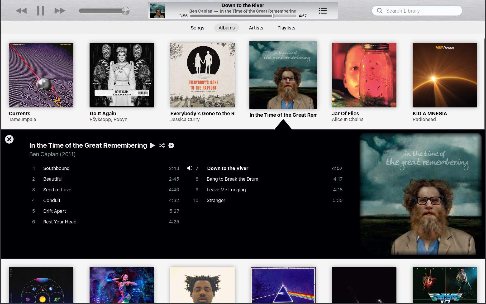

# LFPlayer 

A local first music player



## Packages required for building

* Void Linux

```bash
sudo xbps-install -S git gcc cmake make pkg-config pango-devel cairo-devel librsvg-devel libxcb-devel xcb-util-devel pulseaudio-devel xcb-util-wm-devel libxkbcommon-devel libxkbcommon-x11 libconfig++-devel xcb-util-keysyms-devel xcb-util-image-devel xcb-util-cursor-devel dbus-devel fontconfig-devel alsa-lib-devel papirus-icon-theme lxappearance unzip glew-devel glm taglib-devel
```

* Arch Linux

```bash
sudo pacman -S git gcc cmake make pkg-config pango cairo librsvg libxcb xcb-util pulseaudio xcb-util-wm libxkbcommon libxkbcommon-x11 libconfig xcb-util-keysyms xcb-util-image xcb-util-cursor dbus fontconfig alsa-lib papirus-icon-theme lxappearance unzip glm glew
```

* Ubuntu

```bash
sudo apt install git g++ make cmake checkinstall pkg-config libpango1.0-dev libcairo2-dev librsvg2-dev libxcb1-dev libxcb-util-dev libpulse-dev libxkbcommon-dev libxkbcommon-x11-dev libconfig++-dev libxcb-keysyms1-dev libxcb-image0-dev papirus-icon-theme lxappearance unzip libxcb-randr0-dev libxcb-record0-dev libxcb-ewmh-dev libxcb-icccm4-dev libx11-xcb-dev libxcb-cursor-dev libdbus-1-dev libfontconfig1-dev libasound2-dev libxcb-xinput-dev libxcb-xinput0 libglew-dev libglm-dev
```

* Debian

```bash
sudo apt install git g++ make cmake checkinstall pkg-config libpango1.0-dev libcairo2-dev librsvg2-dev libxcb1-dev libxcb-util-dev libpulse-dev libxkbcommon-dev libxkbcommon-x11-dev libconfig++-dev libxcb-keysyms1-dev libxcb-image0-dev papirus-icon-theme lxappearance unzip libxcb-randr0-dev libxcb-record0-dev libxcb-ewmh-dev libxcb-icccm4-dev libx11-xcb-dev libxcb-cursor-dev libdbus-1-dev libfontconfig1-dev libasound2-dev libcurl4 libcurl4-openssl-dev libxcb-xinput-dev libxcb-xinput0  libglew-dev libglm-dev
```

* Fedora

```bash
sudo yum install git cmake g++ cairo-devel pango-devel librsvg2-devel xcb-util-devel pulseaudio-libs-devel xcb-util-wm-devel libxkbcommon-x11-devel libconfig-devel xcb-util-cursor-devel dbus-devel fontconfig-devel xcb-util-keysyms-devel alsa-lib-devel glm-devel glew-devel
```

## Installation

* Download the source and enter the folder:

```bash
git clone https://github.com/jmanc3/lfplayer
cd lfplayer
```

* Build using cmake and make:

```bash
./install.sh
```

That will install 'lfp' to /usr/local/bin/lfp.

If compilation fails, it should tell you what headers are missing and you can look up what you need to install for your
distribution to get that library.

